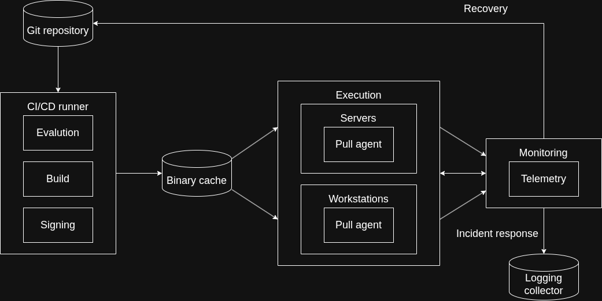
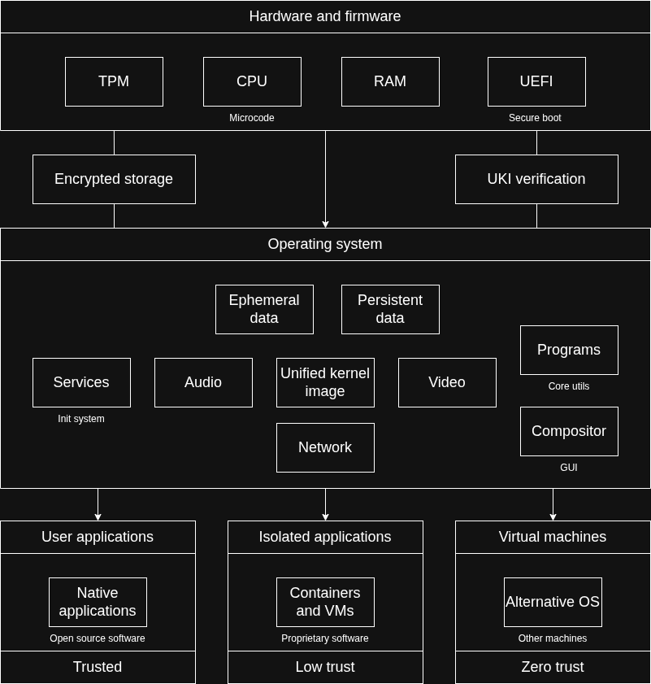
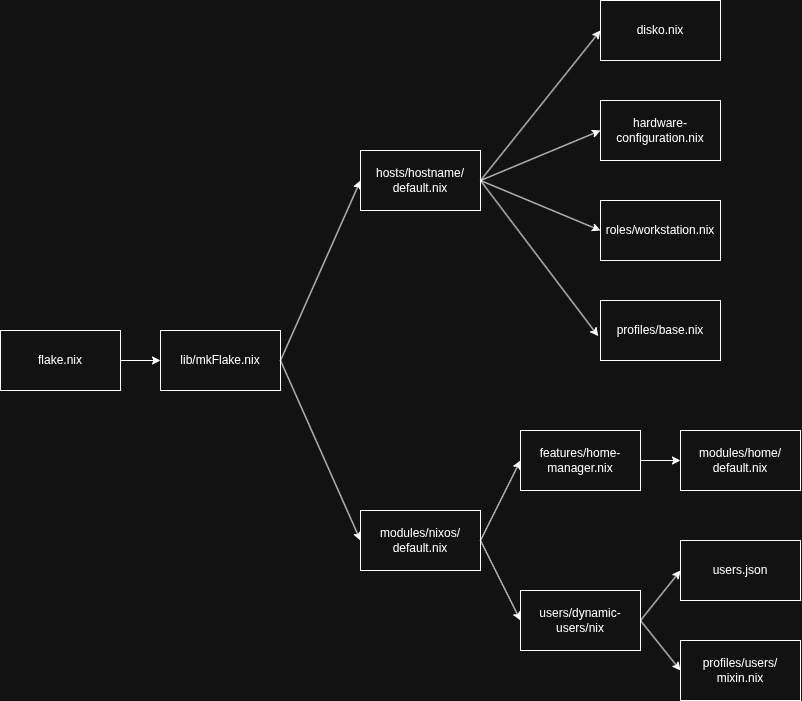
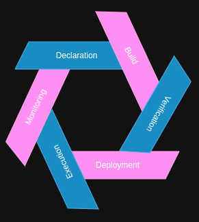
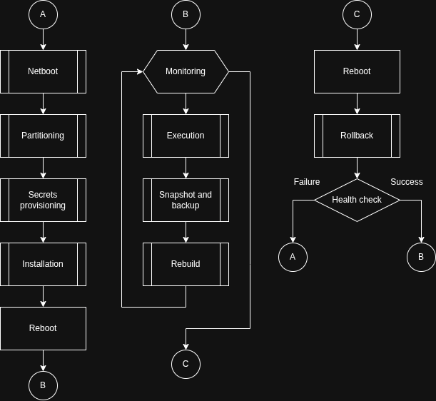

# ❄️ Eira Nyx infrastructure as code

       

## 1. Summary

This is a native NixOS reference architecture which was built on the principles of ephemerality, immutability, recoverability and adaptability. Designed for automated orchestration across large-scale machine fleets, the architecture prioritizes a minimal, composable footprint with native multi-host and multi-user support.

## 2. Architectural philosophy

Brief description of the infrastructure can be seen here as a list.

- Architecture should be scalable from the very beginning. 
- Every phase of the life cycle should be fully automatic.
- No manual intervention allowed within the system state.
- Every update, upgrade and rebuild is performed exclusively via configuration.
- Any undeclared change to the system state is temporary and should be cancelled.
- Reduce downtime to a minimum if an incident occurs.

Speaking about principles, the architecture is defined by eight main principles: ephemerality implies that only explicitly declared data remains between reboots; immutability is a quality of a system to be immune to any interventions and stay unchangeable; recoverability - automatic recovery from incidents; adaptability can be compared to universality; network zero trust - everything that related to the network cannot be trusted if it is not determined; yield - ensures that system is predictable and behaves exactly as described; execution - applying the best security practices on each part of the life cycle.

## 3. Architecture

Using the specification and principles from the previous point, the following diagram presents the infrastructure architecture.



Code is stored in a monorepo which serves as the entry point. Every build is verified via CI/CD runner: update is pulled, built, signed and pushed to binary cache. Binary cache is a vault for signed and compiled binaries. Targets can include various groups of machines, two groups were chosen for the scheme: headless servers and workstation with GUI. Each machine has pull agent that runs on a schedule and updates the system. Monitoring is an external unit which usually applied to servers ensuring automatic incident response and recovery. 

### 3.1 The runtime architecture

On the picture below is showed architecture of a regular workstation node.



Touching intermediate part, every node should have verified boot chain, activate microcode update and encrypted storage. Additional security measurement can be password for UEFI as a tradeoff it can break no human intervention cycle. By utilizing a verified boot chain for validating a unified kernel image we ensure that only this specific kernel can boot. When the system is ready only explicitely persistent data remains, everything else disappears. Network settings such as the firewall, routes, DNS, etc are defined depending on the machine's role.

- Programs - suite of mandatory utils for basic operations.

- Services - only mandatory systemd services.

- Separate user spaces - every user in the system gets their own set of tools and the least privilegies for work.

- User applications are native open source applications with ordinary security measurements like namespaces, cgroups, apparmor profiles, bubblewrap and firejail wrappers. They are considered as trusted and share the same kernel as the host OS.

- Isolated applications are secured via MicroVMs or containers, usually proprietary software that has low trust and should use different kernel than host.

- Virtual machines are used as isolated envirtonments for various experiments where compromise is expected.

### 3.2 Configuration flow

To ensure maximum predicatability this architecture uses deterministic way for configuration management without excessive abstraction layers. This scheme is created to simplify navigation in code and show how the configuration works and how everything is glued together.



flake.nix is the first file, it is used for the dependecies declaration, next it calls custom library the purpose of which is to build a host, import modules and base profile. Host's specific files import hardware configuration and a role with predefined settings.

### 3.3 Table of mechanisms

The list of tools that have been chosen for implementation is available below.

| Technology | Description |
| :--- | :--- |
| NixOS flakes, comin | Orchestration - declarative inputs, automatic rebuilds and state reconciliation |
| Impermanence | Persistence - bind mounts of important data |
| sops-nix | Secrets - decryption of secrets to the RAM |
| networkd, resolved, nftables, wpa-supplicant | Network - determined interfaces, hardened settings, secure DNS, whitelist firewall, wireless connection only within the range of trusted networks |
| Lanzaboote, TPM | Boot - unified kernel images, strict boot chain |
| QEMU/KVM, MicroVM | Virtualization - virtual machines where compromise is assumed, isolated applications |
| Disko, LUKS | Storage - partitioning, formatting, mounts and encryption |
| Colmena, nixos-anywhere | Deployment - installation and deployment |
| Home-manager, stylix | User space - users, overall themes |
| Prometheus, systemd watchdogs | Monitoring - external health check, configuration drifts detection |

The table contains only elements that currently in use, with updates it will be changing.

## 4. Threat model

**WARNING**
The threat model is currently under development

For threat modeling was chosen STRIDE method.
There were identified 5 threats which cause the most damage:

- Physical theft
- Evil maid attack
- User breaks the system
- Data exfiltration, spying
- VM escape

### Trust boundaries

Trusted

- Hardware
- Firmware

Likely trusted

- Kernel
- Operating system
- Daemons, packages and programs on the host system

Untrusted

- Network, Web
- Guest OS in a VM

What to protect

- Persistent data, user's personal data, secrets: ssh keys, credentials. Ensure availability of the data during the execution process.
- Working system state. It implies that system itself must be protected and remain unchangable.

## 5. Infrastructure life cycle

Inspired by NixOS logo, this picture is created to show infinite cycle of improvements, because ideal infrastructure is a moving target and improving is a continuous process. There are 6 phases: declaration, build, verification, deployment, execution and monitoring.



Cycle starts from the code declaration. When the desired state is described, configuration is tested to make sure everything is safe and reproducible. After build it is verified and ready for deployment. While execution it is necessary to observe any detail, so monitoring goes back to declaration, because everything is resolved via configuration.

### 5.1 Operations life cycle

The scheme below describes in details algorithm for core processes.



According to the scheme A - initial bootstrap, B - execution, C - rollback and recovery.

### 5.2 How to add a new host and a user

New host can be added just by creating its default.nix and adding a new user to the database. Below is presented an example of the host specific file

**`hosts/new-server/default.nix`**

```nix
{ inputs, pkgs, ... }:

{
  imports = [
    inputs.disko.nixosModules.disko
    ./disko.nix
    ./hardware-configuration.nix
    ../../roles/server.nix
  ];

  # Identity
  networking.hostName = "new-server";
  nixpkgs.hostPlatform = "x86_64-linux";
  system.stateVersion = "25.11";

  # Deployment metadata
  deployment = {
    targetHost = "10.0.0.10";
    targetUser = "root";
    tags = [ "server" ];
  };
}
```

Users in the infrastructure are treated as data, there is only one user that declared normally and used for some complicated tasks. However to add a regular user it is sufficient to declare him in the database.

**`secrets/users.json`**

```json
{
  "new-user": { 
    "uid": 1010, 
    "fullName": "New User",
    "email": "new-user@company.com",
    "hasSopsPassword": true,
    "tags": ["libvirt_admins"], 
    "hmProfile": "admin.nix",
    "preferences": {
      "keyboard": "us",
      "theme": "gruvbox"
    },
    "sshKeys": ["ssh-ed25519 UUU..."] 
  }
}
```

In the snippet json file is used as example.

## 6. Operations manual

**WARNING**
Currently under development

All operational procedures are fully automated and documented in the `docs/` directory:

**[Bootstrap and installation](docs/INSTALL.md):** How to intall the system on bare metal or Linux machine.  
**[Fleet orchestration](docs/DEPLOY.md):** How to push updates across all the machines.  
**[Disaster recovery](docs/RECOVERY.md):** How host is restored after an incident.  
**[Secret Management](docs/SECRETS.md):** How to re-key the repository and add new admins.

## 7. Deep dives and engineering rationale

To have a better look about the design decisions, overall thoughts you may want to visit a dedicated onion site. Tor hidden service was chosen because of a preference for decentrilized infrastructure, security and availability at the same time bypassing the need for static IP, third-party hosting, DNS, etc.

## 8. Acknowledgements

This architecture uses the Role-Profile pattern, inspired by Tails and Qubes, avoiding libraries.  
Security should be a result of a good design, not a main purpose of a whole system. That is also being said it is not difficult to make a secure system, it is difficult to make it usable.

Speaking about overall security, SculptOS from Genode Labs may be the best solution, including the fact it provides real modularity where one thing cannot break the others, however it lacks some hardware support, therefore does not suit for production or ordinary users.

As it turned out NixOS was unexpectively the first OS I had found that went along with my vision of a system that can not be broken, where user can do whatever he wants and it recovers after reboot to its primary state. When configured correctly the system can be pretty minimal, it does the least things user requires at the moment and behaves exactly as described. Moreover nature of NixOS allows to make everything modular, reproducible and transparent.
